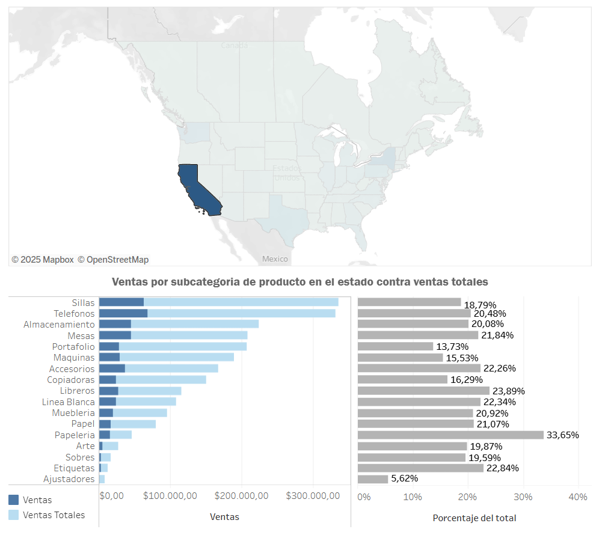

# Cesar-s-Portfolio
Portafolio de Análisis de Datos

# Proyecto: Análisis Financiero con Expresiones LOD (Level of Detail)
Las expresiones de nivel de detalle (LOD) permiten calcular fácilmente agregaciones que no tienen el nivel de detalle de la visualización. Posteriormente, estos valores se pueden agregar en las visualizaciones de forma arbitraria, lo cual permite la elaboración de análisis que ofrecen información más especifica y que interrelaciona datos diferentes.

A continuación se detallan algunas herramientas de visualización utilizando expresiones LOD en Tableau y desarrolladas utilizando una base de datos ficticia que simula la operación de una tienda de artículos de oficina en Canadá y Estados Unidos, ofreciendo datos como órdenes de compra, clientes, productos, ventas y ubicación de las ventas.

Los títulos de cada herramienta desarrollada han sido vinculados a Tableau Public, donde se puede interactuar con las visualizaciones.

### Herramientas utilizadas: Campos calculados, funciones, calculos de tabla, expresiones LOD, paramétros, filtros. 

## [1.- Análisis de Frecuencia de las Ordenes de los Clientes](https://public.tableau.com/views/1_-AnalissLODFrecuenciadeOrdenesdeClientes/FRECUENCIADEORDENESDECLIENTES?:language=es-ES&:sid=&:redirect=auth&:display_count=n&:origin=viz_share_link)
### ¿Cuántos clientes han hecho 1, 2, 3,…, n órdenes de compra?

Calcular el número de pedidos que ha realizado cada cliente es relativamente fácil, pero ¿qué sucedería si quisiéramos saber cuántos clientes hicieron uno, dos, tres, etc.? Para crear esta vista, se desglosa el número de clientes por el número de pedidos realizados con ayuda de expresiones LOD.
## [2.- Análisis de Generación(Cohort Analysis)](https://public.tableau.com/views/2_-AnlisisLODGeneracindeClientesCohortAnalysis/DASHBOARDANLISISDEGENERACIN?:language=es-ES&:sid=&:redirect=auth&:display_count=n&:origin=viz_share_link)
### ¿Cuánto contribuye a la ganancia cada generación anual de clientes?

La visualización a continuación agrupa a los clientes por generaciones de acuerdo con el año de su primera compra para comparar las contribuciones a las ventas anuales entre ellas. La fecha mínima de pedido por cliente indicará la fecha de la primera compra y por tanto, la adquisición de dicho cliente. Dado que los datos de la visualización no se muestran por cliente, debemos usar una expresión LOD para fijar la fecha mínima de pedido por cliente.
## [3.- KPI de Rentabilidad Diaria](https://public.tableau.com/views/3_-AnlisisLODKPIdeRentabilidadDiaria/KPIGANANCIASDIARIAS?:language=es-ES&:sid=&:redirect=auth&:display_count=n&:origin=viz_share_link)
### ¿Cuántos días de cada de mes fueron redituables, poco redituables y en cuales hubo pérdidas?

Es usual visualizar las tendencias de ganancias a lo largo del tiempo, pero ¿qué sucede si medimos nuestro éxito según la ganancia total por día hábil? Podemos saber el número de días rentables logrados cada mes o año, especialmente si nos interesan los efectos estacionales. Las expresiones LOD nos permiten crear fácilmente intervalos con datos agregados, como la ganancia diaria, mientras que los datos subyacentes se registran a nivel transaccional.
## [4.- Análisis del Porcentaje del Total](https://public.tableau.com/views/4_-AnlisisLODPorcentajedelTotal/PORCENTAJEDELTOTAL?:language=es-ES&:sid=&:redirect=auth&:display_count=n&:origin=viz_share_link)
### Para la zona que abarca el mercado, ¿Cuánto aporto cada estado a las ventas totales?

Si coloreamos por porcentaje de contribución, vemos inmediatamente que California tiene la mayor contribución a las ventas globales. Sin embargo, podríamos centrarnos en visualizar la contribución en una sola región. Sin expresiones LOD, filtrar por región provocaría que se recalculara el porcentaje del total, mostrando la contribución de cada estado a su región. Con una expresión LOD simple, podemos filtrar por un mercado y, aun así, medir la contribución global.
## [5.- Análisis Comparativo de Ventas](https://public.tableau.com/views/5_-AnlisisLODComparativodeVentas/DASHBOARDANALISISCOMPARATIVODEVENTAS?:language=es-ES&:sid=&:redirect=auth&:display_count=n&:origin=viz_share_link)
### ¿Cómo se comparan las ventas de las diferentes categorias de productos contra una de ellas en particular?

Es relativamente sencillo hallar la diferencia de ventas de un producto con la venta promedio, pero ¿qué ocurre si se desea hallar la diferencia con una categoría seleccionada? Primero, se aíslan las ventas de dicha categoría. Luego, se usa una expresión EXCLUDE para repetir ese valor en todas las demás categorías. De esta manera, utilizando un botón que modifica el parámetro (la categoría que se toma como referencia), se expone la diferencia de ventas entre dicha categoría y las del resto.
## [6.- Retorno de compras por generación](https://public.tableau.com/views/6_-AnlisisLODRetornodecomprasporgeneracin/DASHBOARDCOMPRASREPETIDASPORGENERACIN?:language=es-ES&:sid=&:redirect=auth&:display_count=n&:origin=viz_share_link)
### ¿Después de la primera compra, cuántos trimestres les toma a los clientes realizar otra de nuevo?

Adquirir nuevos clientes puede ser costoso, por lo que queremos asegurarnos de que los clientes existentes realicen compras recurrentes. ¿Cuántos clientes tardan uno, dos, tres o N trimestres en repetir una compra? ¿Cuántos nunca han repetido una compra?
Podemos usar una expresión fija para encontrar las fechas de la primera y la segunda compra por cliente y, a partir de esto, obtener el número de trimestres necesarios para repetir una compra. Esto se esboza a través de un heatmap que nos indica como se concentran los clientes de acuerdo con su generación y trimestres requeridos para repetir una compra.
## [7.- Cepillado Proporcional](https://public.tableau.com/views/7_-AnlisisLODCepilladoProporcional/DASHBOARDCEPILLADOPROPORCIONAL?:language=es-ES&:sid=&:redirect=auth&:display_count=n&:origin=viz_share_link)
### ¿Cuánto contribuye cada estado al total de compras por producto?

A veces, al filtrar, queremos comparar la selección con la cantidad total, en lugar de filtrar solo la selección. Esta técnica se conoce como cepillado proporcional. Se presenta un mapa interactivo donde la selección ajusta el gráfico para indicar cuanto ha aportado el estado a las ventas de cada producto. 
## [8.- Frecuencia de compras anuales por generación de cliente](https://public.tableau.com/views/8_-AnlisisLODFrecuenciadecomprasanualesporgeneracindecliente/Nmerodecomprasporclienteenelao?:language=es-ES&:sid=&:redirect=auth&:display_count=n&:origin=viz_share_link)
### ¿Qué porcentaje de clientes correspondiente a cada generación compraron 1, 2, 3,..., N veces en 2022?

¿Qué clientes son más leales de acuerdo con su antigüedad? En este gráfico, la antigüedad se mide por el año de adquisición del cliente y la lealtad por la frecuencia anual de compra?
Sabemos, por el ejemplo 1, cuántos clientes compran exactamente una vez, exactamente dos veces, etc. Sin embargo, rara vez se querrá identificar a todos los clientes que compraron exactamente cinco veces. En cambio, puede ser más útil saber cuántos clientes compraron al menos cinco veces.
Además, por el ejemplo 2, sabemos que la mayoría de los clientes se adquirieron en 2011 y la menor cantidad en 2014. Analizar el número absoluto de clientes solo revelará esta misma tendencia. Por lo tanto, puede ser más interesante observar el porcentaje total de clientes por generación como medida de lealtad.
Este gráfico combina una variación de la expresión LOD del número de pedidos del ejemplo 1, la expresión de cohorte del ejemplo 2 y una variación del porcentaje del total de la expresión del ejemplo 4.

#Proyecto: Dashboard en Excel

